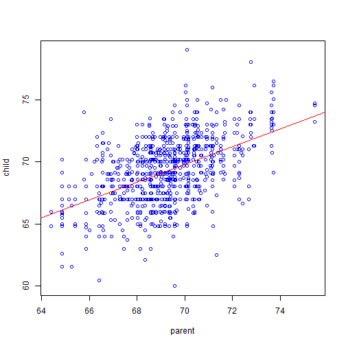
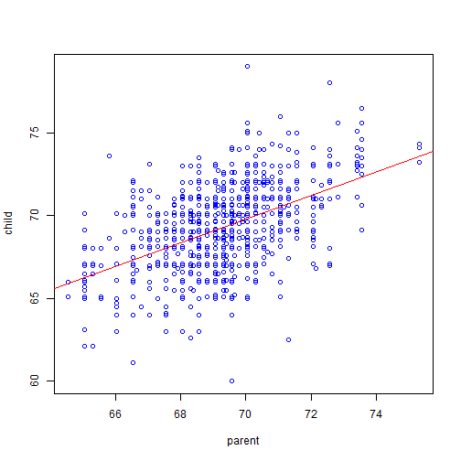

Transmuting Women into Men
========================================================

(inspired by J. A. Henley's 2004 paper of the same title in "The American Statistics" **58**(3))
--------------------------------------------------------

### YoungJung Chang

Background
========================================================

- Although controversial, computing a _unisex_ height could be useful in predicting children's adult heights from parents'
- In general, mother's height is slightly increased and averaged with father's height to calculate __mid-parent__ height
- The son's height is predicted from the mid-parent height
- The daughter's height estimate is obtained by slightly decreasing the son's estimate
- Galton used multiplicative model to convert female heights to male equivalents
- Modern-day calculators employ simple additive model for the same purpose

Exploratory Analysis
========================================================


```r
library(HistData)
g<-GaltonFamilies; names(g)[8]<-"child"
summary(c(g$father,g$child[g$gender=="male"]))
```

```
   Min. 1st Qu.  Median    Mean 3rd Qu.    Max. 
  60.00   68.00   69.00   69.21   71.00   79.00 
```

```r
summary(c(g$mother,g$child[g$gender=="female"]))
```

```
   Min. 1st Qu.  Median    Mean 3rd Qu.    Max. 
  56.00   62.70   64.00   64.09   65.50   70.50 
```

Two Models' Performance is Comparable
========================================================
__Multiplicative model__

[male] = 1.08 * [female]
 

***
__Additive model__

[male] = 5.11" + [female]
 

Need for Automated Regression Calculations
========================================================

- Constants can vary with time (e.g., humans grew approximately 4" for the last 100 years)
- Testing slightly different constants to fit for specific ethnic types
- The shiny app can show how these different constants play out with GaltonFamilies data at the least
- With different datasets available, the app can be adapted in rather a straightforward fashion
